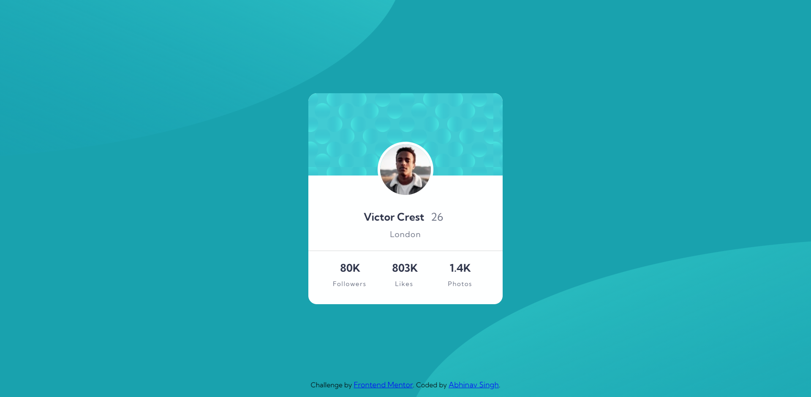

# Frontend Mentor - Profile card component solution

This is a solution to the [Profile card component challenge on Frontend Mentor](https://www.frontendmentor.io/challenges/profile-card-component-cfArpWshJ). Frontend Mentor challenges help you improve your coding skills by building realistic projects. 

## Table of contents

- [Overview](#overview)
  - [The challenge](#the-challenge)
  - [Screenshot](#screenshot)
  - [Links](#links)
- [My process](#my-process)
  - [Built with](#built-with)
  - [What I learned](#what-i-learned)
- [Author](#author)

## Overview

### The challenge

- Build out the project to the designs provided

### Screenshot
## Desktop View

## Mobile View

### Links

- Solution URL: [View Code](https://github.com/abhinav-gif/profile-card-component)
- Live Site URL: [Preview Site](https://abhinav-gif.github.io/profile-card-component/)

## My process

### Built with

- Semantic HTML5 markup
- CSS custom properties
- Flexbox
- CSS Grid
- Mobile-first workflow
- CSS animations

### What I learned

Learned Use of z-index property and css animation and keyframes.

## Author

- Frontend Mentor - [@abhinav-gif](https://www.frontendmentor.io/profile/abhinav-gif)
